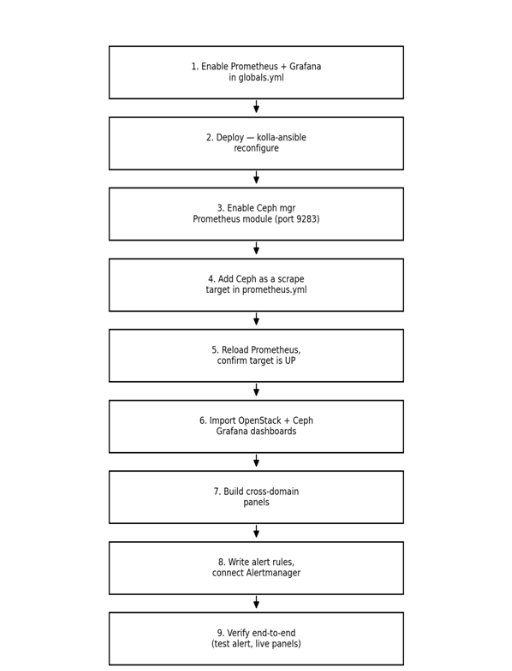

# Final Recommendation Best Tool for Monitoring OpenStack Integrated with Ceph

**After evaluating all available options (Zabbix, Ceph Dashboard alone,
Telegraf + InfluxDB + Grafana, ELK/OpenSearch alone, Nagios/Icinga, two
separate Grafana instances, and newer 2026 tools such as
VictoriaMetrics, SigNoz, Datadog, and Last9), Prometheus + Grafana, run
as one shared instance, is confirmed as the best and final tool for
monitoring the entire OpenStack deployment integrated with Ceph on a
single dashboard.**

1.  **Why Prometheus + Grafana Is the Best Choice**

    - Kolla-Ansible already deploys Prometheus and Grafana by default,
      with exporters for Nova, Neutron, Keystone, Cinder, HAProxy,
      MariaDB, RabbitMQ, and hosts  no new tool needs to be
      introduced.

    - Ceph natively exposes a Prometheus-compatible /metrics endpoint
      via \'ceph mgr module enable prometheus\' on port 9283  no
      separate agent or exporter is required.

    - Adding Ceph as one more scrape target in the same prometheus.yml
      Kolla-Ansible manages brings both systems into one Prometheus
      instance.

    - Importing Ceph\'s official Grafana dashboards (Cluster, OSD, Pool,
      RBD Overview) into the same Grafana that holds the OpenStack
      dashboards produces a single, unified view.

    - Cross-domain panels can be built  e.g., Cinder volume creation
      time next to Ceph pool IOPS

 showing immediately whether a slowdown originates in the compute/API
layer or the Ceph storage backend.

- One Alertmanager/Grafana Alerting pipeline routes both OpenStack and
  Ceph alerts to the same notification channel.

- No licensing cost, no third-party data sharing, and no custom
  integration scripts, unlike every alternative evaluated.

2.  **How Prometheus + Grafana Works (Mechanics)**

#### Prometheus (the collector)

- Works on a \"pull\" model it reaches out to targets on a timer
  (default 15--30 seconds) instead of waiting for them to send data.

- Each target (an \"exporter\") runs a tiny web server exposing a
  /metrics page in plain text.

- Prometheus reads that page, timestamps every value, and stores it in
  its own built-in time-series database on disk.

- Nothing else in the stack collects data Grafana and Alertmanager both
  depend on Prometheus already having it.

#### Grafana ( the display)

- Connects to Prometheus as a \"data source\" and runs PromQL queries
  behind the scenes when a dashboard is opened.

- Turns the returned numbers into graphs, gauges, and tables.

- Allows importing ready-made dashboards (JSON files) instead of
  building panels from scratch.

#### Alertmanager (the notifier)

- Prometheus itself decides when something is wrong, based on rules
  written in advance (e.g., \"OSD down for 5+ minutes\").

- It hands the firing alert to Alertmanager, which groups similar
  alerts, avoids duplicate pings, and sends the notification to
  Slack/email.

### Step-by-Step Process Production Setup

- Enable the stack in Kolla-Ansible : set enable_prometheus: \"yes\" and
  enable_grafana: \"yes\" in globals.yml.

- Deploy it  run \'kolla-ansible reconfigure\' (or deploy); Kolla
  installs Prometheus, Grafana, and the OpenStack exporters as
  containers automatically, and wires the scrape config.

- Turn on Ceph\'s own metrics endpoint  run \'ceph mgr module enable
  prometheus\' on the Ceph cluster; this exposes /metrics on port 9283,
  no agent required.

- Point Prometheus at Ceph  add the Ceph mgr node\'s IP and port 9283
  as one more entry in the scrape_configs section of prometheus.yml.

- Restart/reload Prometheus so it picks up the new target  check the
  Prometheus \"Targets\" page to confirm Ceph shows as UP.

- Import dashboards into Grafana  use the official dashboard IDs
  (OpenStack: 9701/21085, Ceph: 2842) so both sets of panels exist in
  the same Grafana instance.

- Build cross-domain panels  place an OpenStack metric and a Ceph
  metric on the same panel (e.g., Cinder volume creation time next to
  Ceph pool IOPS) so cause and effect are visible together.

- Write alert rules covering both systems (OSD down, Galera desync, disk
  full, HAProxy backend down) and route them through Alertmanager to one
  shared channel.

- Verify end-to-end  trigger a test alert, confirm it reaches
  Slack/email, and confirm both OpenStack and Ceph panels update live in
  Grafana.

## Result

Once these steps are complete, opening one Grafana URL shows the health
of the entire OpenStack deployment and the Ceph storage backend on a
single screen  instance counts, service status, database quorum, and
Ceph OSD/pool health sit alongside correlated performance graphs (Cinder
next to Ceph latency, Nova boot time next to pool IOPS) and live alerts,
giving operators one place to look during both routine checks and
incident response.
