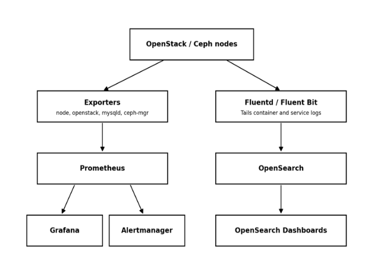

# Monitoring

Overall monitoring stack and why metrics and logs are kept as separate
pipelines:

- Prometheus performs metrics collection and alerting rules; Grafana
  provides dashboards; Alertmanager handles notification routing.

- An OpenSearch/Fluentd pipeline (Fluentd or Fluent Bit, OpenSearch,
  OpenSearch Dashboards) handles centralized logs.

- Metrics and logs are two separate pipelines on purpose: metrics show
  that something is wrong and when; logs show why.

- The same exporter-based pattern is reused across every OpenStack
  service, so operators only need to learn one model.

> 
# Core OpenStack API Services (Nova, Neutron, Keystone, Glance)

- Nova, Neutron, Keystone, and Glance are monitored via
  openstack-exporter, which polls each API on an interval and converts
  the response into Prometheus metrics.

- Nova: instance states, hypervisor stats, and resource usage, plus
  node_exporter for host-level CPU/RAM/disk on compute nodes.

- Neutron: L3/DHCP/OVS agent up-down status and port/network counts,
  plus blackbox_exporter ICMP/TCP probes on floating IPs and VIPs to
  confirm real reachability.

- Keystone: blackbox HTTP probes for API reachability and token issuance
  latency, since every other service depends on Keystone being up.

- Glance: node_exporter tracks image-store disk usage (a full store
  blocks new builds) alongside openstack-exporter's image list/status,
  correlated on one Grafana panel.

- Nagios/Zabbix-style tools were skipped here because they need manual
  plugin scripts for OpenStack APIs; Ceilometer/Gnocchi was skipped as
  heavier and largely deprecated.

| Component | Primary Tool | Key Signal |
|---|---|---|
| Nova (Compute) | openstack-exporter + node_exporter | Instance/hypervisor state, host resources |
| Neutron (Networking) | openstack-exporter + blackbox_exporter | Agent status, floating IP/VIP reachability |
| Keystone (Identity) | blackbox_exporter (HTTP probe) | Endpoint availability, token latency |
| Glance (Image) | openstack-exporter + node_exporter | Image status, store disk usage |

## Storage Monitoring Ceph Backend

- Storage monitoring is Ceph-first because the actual persistent data
  lives on Ceph, not on the Cinder API itself (see section 1.2).

- ceph-mgr runs a Prometheus plugin exposing OSD up/down/in/out state,
  placement group (PG) status, pool capacity/usage, and cluster I/O
  throughput and latency.

- This sits underneath the Cinder/Glance API checks: the API layer shows
  whether an operation succeeded; the Ceph layer shows why it might be
  slow or failing.

- A degraded PG count or a downed OSD is exactly the kind of backend
  problem that causes slow or failed volume attach/detach without ever
  appearing as a Cinder-level error.

- Monitoring only the Cinder API and skipping the Ceph layer is the
  single most common gap in OpenStack monitoring setups.

| Layer | Tool | Key Signal |
|---|---|---|
| Ceph cluster | ceph-mgr Prometheus module | OSD state, PG health, pool capacity |
| Cinder API | openstack-exporter | Volume state counts (available/in-use/error) |
| Glance API | openstack-exporter | Image status, backed by Ceph RBD pool |

## Application & Orchestration Services (Horizon, Heat, Octavia, Zun)

- Horizon: blackbox_exporter issues an HTTPS GET against the login page
  (status code, response time, cert expiry) since a process-level check
  can pass while the app itself is broken.

- Heat: openstack-exporter reports stack counts by status
  (CREATE_COMPLETE, FAILED); Fluentd tails heat-engine logs to
  OpenSearch so OpenSearch Dashboards can surface the root cause.

- Octavia: openstack-exporter polls loadbalancer/listener/pool/member
  status; blackbox_exporter probes the VIP:port directly, since amphora
  status alone can miss a misconfigured listener.

- Zun: cAdvisor reads cgroups for true per-container CPU/memory/network,
  since the Zun API alone only shows reported state, not actual
  consumption.

- Each of these services is watched on both a control-plane signal and a
  data-plane/user-facing signal, not just one.

| Component | Primary Tool | Key Signal |
|---|---|---|
| Horizon (Dashboard) | blackbox_exporter (HTTP probe) | Page load status, TLS cert expiry |
| Heat (Orchestration) | openstack-exporter + Fluentd logs | Stack status, failure root cause |
| Octavia (Load Balancer) | openstack-exporter + blackbox_exporter | Amphora state, VIP reachability |
| Zun (Containers) | cAdvisor + Prometheus | Per-container CPU/memory/network |

## Infrastructure Layer (Database, Messaging, Load Balancing)

- MariaDB/Galera: mysqld_exporter runs as a monitoring user and reports
  wsrep_* variables — node state, replication lag, and cluster quorum.

- Generic host monitoring alone will not show replication lag or
  split-brain risk, which is why a MySQL-aware exporter is required.

- RabbitMQ: the Prometheus plugin exposes queue depth, message rates,
  and consumer counts, since queue backlog is the earliest sign of an
  overloaded service (e.g. Nova conductor falling behind).

- HAProxy: haproxy_exporter reads the stats socket for backend up/down
  state and request metrics, combined with a blackbox_exporter probe
  directly on the VIP.

- The HAProxy + VIP combination catches cases where HAProxy's own view
  of a backend disagrees with reality due to a check misconfiguration.

| Component | Primary Tool | Key Signal |
|---|---|---|
| MariaDB / Galera | mysqld_exporter + Grafana Galera dashboard | Node state, replication lag, quorum |
| RabbitMQ | RabbitMQ Prometheus plugin | Queue depth, unacked messages |
| HAProxy + Keepalived (VIP) | haproxy_exporter + blackbox_exporter | Backend health, VIP failover |

## Host & Container Layer

- Every Kolla-Ansible service runs as a Docker container, so container
  restart counts and resource limits are a first-line signal across the
  deployment.

- cAdvisor exposes per-container state and restart counts; Docker's own
  HEALTHCHECK directive (built into Kolla images) flags unhealthy
  containers.

- node_exporter runs on every node and exposes CPU, memory, disk I/O,
  filesystem, and network metrics in Prometheus format.

- Alertmanager fires a notification whenever a defined threshold — e.g.
  disk usage above 85% — is crossed.

- Vendor dashboards (iDRAC/iLO) or ad hoc 'top'/'htop' checks were not
  used as the primary signal since they give a snapshot, not historical
  trend data or automated alerts.

| Layer | Tool | Key Signal |
|---|---|---|
| Docker containers (Kolla runtime) | cAdvisor + Docker healthchecks | Restart counts, unhealthy containers |
| Host / OS (all nodes) | node_exporter + Alertmanager | CPU, memory, disk, network thresholds |

## Why This Combination Over a Single All-in-One Tool

- Commercial all-in-one suites (Zabbix, SolarWinds, Datadog) can
  technically monitor everything, but need paid licensing at
  data-center scale.

- Zabbix was evaluated directly for this deployment and would still need
  custom scripts to understand Nova, Neutron, and Ceph the way
  openstack-exporter and ceph-mgr already do natively.

- Prometheus + Grafana + exporters is open source and container-native,
  fitting the Kolla/Docker model directly rather than fighting it.

- A purpose-built openstack-exporter is maintained specifically for
  OpenStack API monitoring.

- Alertmanager handles alert routing and deduplication without needing a
  separate paid alerting product.

- The full comparison against every alternative considered, including
  newer 2026 tools, is presented in sections 13 and 14.
